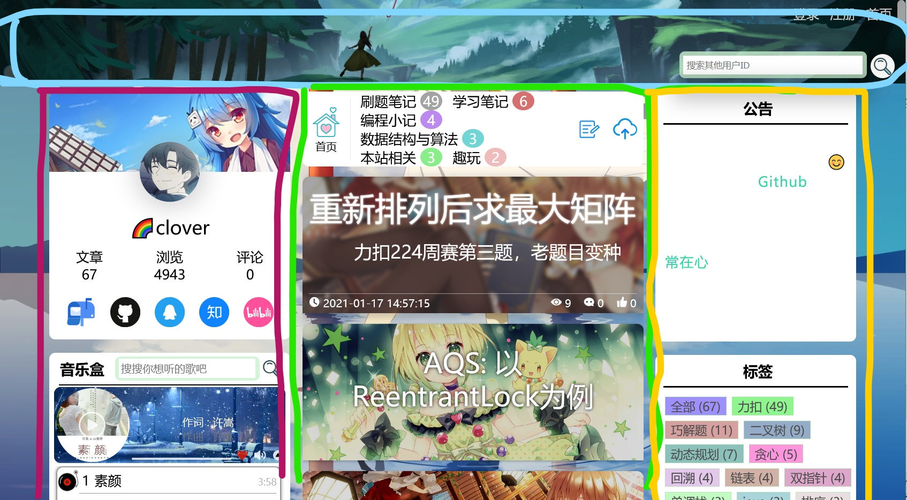
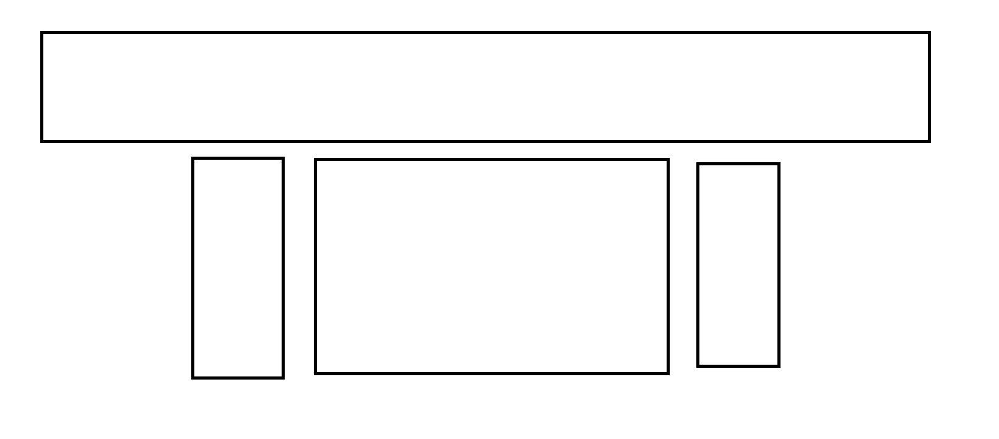

# 个人博客开发
做个人博客的主要原因是想要记录下代码学习之路，主要记载
内容为学习笔记心得，以及算法讲解思路

##思路
本博客主要模仿 `四叶草博客` 以及 `小游网`  
###观察布局:
  
以及
  
两者的布局都差不多，但是布局内组件功能不太一样
###路由设置
  

这些都是有点击跳转功能的组件

###开始
规划布局:  
  

<big>先学习一遍  sass ....</big>  
  
----------------
首先是navbar ，切成三块

------------------
关于音乐盒，由于博客只是将音乐搜索功能作为附加功能，  
因此只实现基本的功能，  
搜索 -》 歌曲源，歌曲名，时间长度  
进度条   
为实现自定义的进度条 和 音频播放联动  
  
写代码心得：先进行整体的构思（细节可以先不考虑），  
要求构思的代码能完成主体功能（有bug也没关系），  
之后 将bug和需要补充的细节 像打补丁一样在代码上改改修补就行了,  
构思前最好那纸和笔画一下流程图       